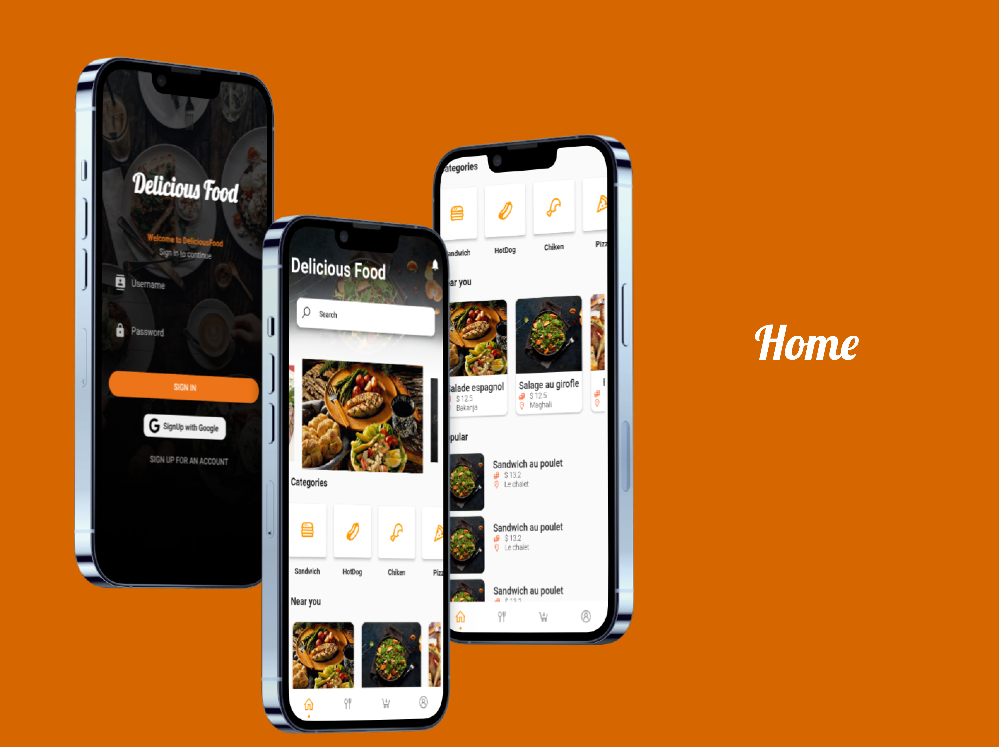
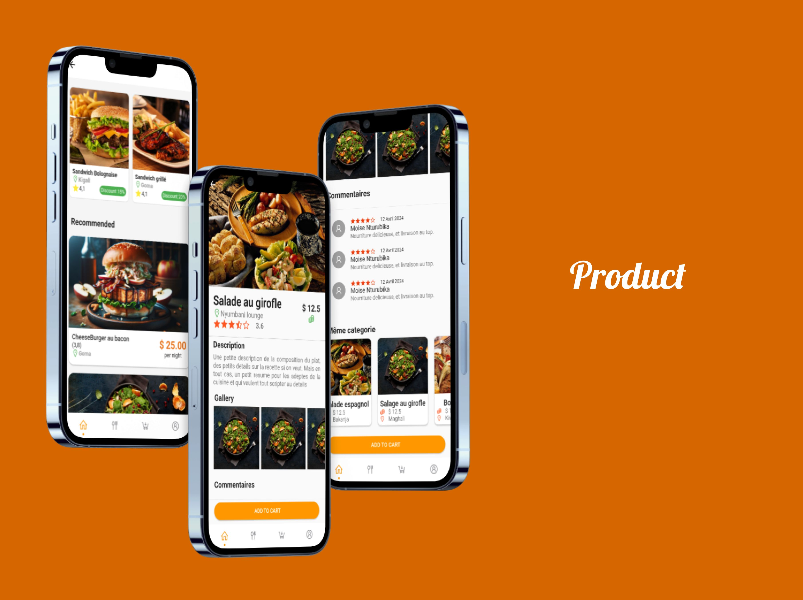
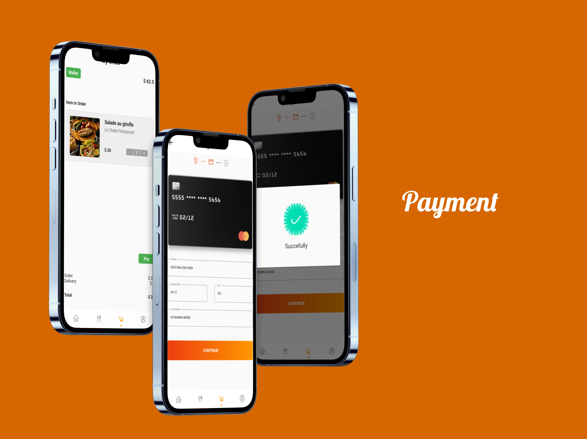

<h1 align="center">
   
   
    Delicious Food
   
</h1>

<h4 align="center">Delicious Food: Explore local restaurants, discover specialties, and order fast delivery.</h4>

<!-- 

  [Project's badges]

 -->

  <a href="#about">About</a> •
  <a href="#key-features">Key Features</a> •
  <!-- <a href="#getting-started">Getting Started</a> • -->
  <a href="#faq">FAQ</a> •
  <a href="#roadmap">Roadmap</a> •
  <a href="#support">Support</a> •
  <!-- <a href="#license">License</a> -->

## About

Delicious Food is a mobile app that provides a unique dining experience by allowing users to explore a variety of local restaurants, discover their culinary specialties, and place orders for fast and convenient delivery.

## Key Features

- Google authentification
- Credit card payment
- Explore local restaurants
- Explore good price foods

<!-- ## Main screens

1. Login

2. Product

3. Payment

4. Profil
 -->

## You may also like...

List of apps or libs that do similar stuff as your project.

- [Financial](https://github.com/othneildrew/Best-README-Template)
- [PharmaKit](https://gist.github.com/DomPizzie/7a5ff55ffa9081f2de27c315f5018afc)

---

> [Moïse Nturubika](https://github.com/Moise-Nturubika) &nbsp;&middot;&nbsp;
> GitHub [@moise-nturubika](https://github.com/Moise-Nturubika) &nbsp;&middot;&nbsp;
> Twitter [@moise-nturubika](https://twitter.com/moise-nturubika)